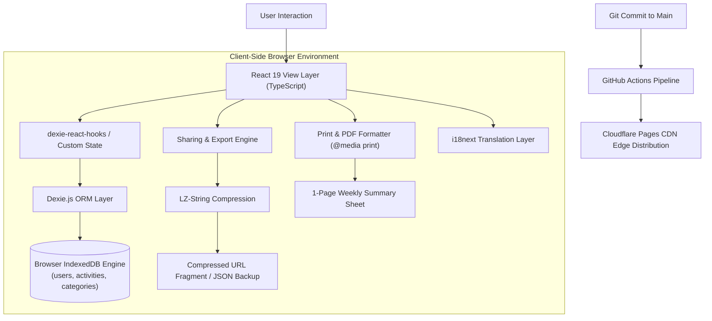

# Activity Log PWA ⏱️

[](https://activity-log-pwa.pages.dev/)
[](https://react.dev/)
[](https://www.typescriptlang.org/)
[](https://vitejs.dev/)
[-purple?style=for-the-badge&logo=databricks&logoColor=white)](https://dexie.org/)
[](https://github.com/Etherdancer/activity-log-pwa/actions)
[](https://opensource.org/licenses/MIT)

> **Activity Log** is a modern, local-first daily activity and habit tracking Progressive Web App. Built with React 19, TypeScript, and Dexie.js (IndexedDB), it provides fluid weekly time auditing, multi-profile tracking, compressed share links, and printable weekly sheets—**with zero remote server tracking.**

---

## 💡 Architecture & Philosophy

Most time-tracking and habit applications force users into cloud subscriptions, selling analytics or risking privacy. **Activity Log** is engineered as a **Local-First Software** application:

1. **Client-Side Sovereignty**: Data lives strictly in the browser's structured IndexedDB storage engine.
2. **Instant Reactive Updates**: Dexie live queries (`dexie-react-hooks`) provide frictionless UI state sync across tabs.
3. **Data Compression & Portability**: State can be exported, backed up to JSON, or compressed into URL fragments via `lz-string` for cross-device peer sharing without centralized databases.
4. **Print & PDF Optimization**: Includes dedicated CSS `@media print` rules designed to render a complete week of activities on a single clean printable page.

---

## 🚀 Key Features

- **Interactive Weekly Calendar**: Hourly grid visualization showing daily tasks, intervals, and routines at a glance.
- **Multi-User Profile Switching**: Effortlessly manage and switch between distinct user profiles or workspaces locally.
- **Real-Time Data Persistence**: Low-latency ACID-compliant transactions powered by IndexedDB through Dexie.js.
- **Compressed P2P Sharing**: Share specific activity schedules via compressed URL payloads using LZ-string encoding.
- **Internationalization (i18n)**: Native multilingual architecture powered by `i18next` and `react-i18next`.
- **Installable PWA**: Works completely offline on iOS, Android, macOS, Linux, and Windows with Service Worker caching.
- **Automated CI/CD**: GitHub Actions workflow automatically verifies builds and deploys directly to Cloudflare Pages edge network on every commit.

---

## 🛠️ Architecture Overview



---

## 💻 Tech Stack

| Domain | Technology |
| :--- | :--- |
| **Frontend Framework** | React 19, Modern TypeScript 5 |
| **Build & Bundler** | Vite 8 with `@vitejs/plugin-react` |
| **Storage Engine** | IndexedDB via Dexie.js 4 & `dexie-react-hooks` |
| **Date & Time** | `date-fns` 4 |
| **Localization** | `i18next` & `react-i18next` |
| **Compression** | `lz-string` |
| **PWA & Service Worker** | `vite-plugin-pwa` (Workbox) |
| **Icons & UI** | Lucide React, Modern CSS Modules |
| **CI/CD** | GitHub Actions & Cloudflare Pages |

---

## 🚦 Getting Started

### Prerequisites
- Node.js (v18+)
- npm or yarn

### Installation
```bash
# Clone the repository
git clone https://github.com/Etherdancer/activity-log-pwa.git

# Navigate to project folder
cd activity-log-pwa

# Install dependencies
npm install

# Run development server
npm run dev
```

### Production Build & Linting
```bash
# Type check and build production distribution
npm run build

# Run ESLint validation
npm run lint

# Preview build locally
npm run preview
```

---

## 📄 License

This project is licensed under the [MIT License](LICENSE).
